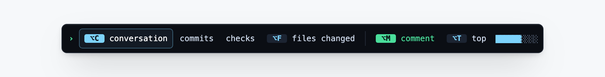

# GitHub Quickview

[](https://github.com/yingzhox/github-quickview/actions/workflows/ci.yml)
[](https://github.com/yingzhox/github-quickview/releases/latest)
[](LICENSE)



A small, dependency-free Chrome extension for pull requests that have grown too long to navigate comfortably—especially PRs with repeated agent review rounds.

An always-visible command bar sits at the bottom of every supported pull request. It is keyboard-first by design: each control leads with its shortcut key and follows it with a lowercase label. The bar keeps Conversation, Commits, Checks, and Files changed one click away and adds the action that matters on the current page:

- **Conversation** goes directly to the comment composer when clicked; an ordinary page load keeps its original scroll position.
- **Comment** jumps to and focuses GitHub's native comment composer.
- **Review** opens GitHub's native Submit review control.
- **Back to top** returns to the PR header.
- Reading position is drawn as a ten-cell meter rather than written as a percentage. The percentage is still announced to assistive technology.

The extension never posts, approves, merges, or sends data itself.

## Shortcuts

Shortcuts work outside text fields, so they never interfere while you are writing a comment.
The defaults are:

| Action | macOS | Windows/Linux |
| --- | --- | --- |
| Conversation | `⌥C` | `Alt+C` |
| Files changed | `⌥F` | `Alt+F` |
| Comment | `⌥M` | `Alt+M` |
| Back to top | `⌥T` | `Alt+T` |

To change them, open `chrome://extensions`, find **GitHub Quickview**, and choose
**Details → Extension options**. Select a shortcut field and press a single letter or
number, such as `C` or `1`. Ctrl, Alt (Option), Shift, and Command are optional.
Choose **Clear** to disable an
action's shortcut, or **Restore defaults** to reset the assignments, then **Save shortcuts**.
Duplicate assignments must be resolved before saving. GitHub, browser, and operating system
shortcuts may take priority over your chosen keys.

Settings are saved locally on this device. Open PR tabs update their shortcuts and key
hints immediately. After updating the unpacked extension, reload it and refresh existing
PR tabs once to load the new settings support.

## Density

The bar sheds detail as the window narrows: full labels above 860 px, short labels below
it, and keys below 480 px. Controls without a shortcut keep their short labels.

## Install

Download `github-quickview-<version>.zip` from the
[latest release](https://github.com/yingzhox/github-quickview/releases/latest)
and unzip it, or clone this repository. Then:

1. Open `chrome://extensions`.
2. Enable **Developer mode**.
3. Choose **Load unpacked**.
4. Select this repository folder.
5. Open or refresh a GitHub pull request.

## Design and privacy

- Manifest V3 content scripts and an extension options page, with no background worker.
- Requests only the `storage` permission to save shortcut preferences locally. No
  analytics, network calls, remote code, or stored page content.
- Runs only on `https://github.com/*/*/pull/*`.
- Uses GitHub's native navigation links and controls rather than recreating review actions.
- Keeps a single terminal palette in both GitHub themes. A command bar that repaints
  itself to match the page stops reading as a command bar, so the slab stays constant
  and only its shadow adapts.
- Sets type in a system monospace stack. The extension makes no network requests, so a
  web font is not available to it.
- Avoids GitHub's generated CSS-module class names and fails safely if expected semantic markup is unavailable.

## Development

No install step is required.

```sh
npm test       # unit and controller tests
npm run check  # syntax and manifest validation
npm run build  # produce dist/github-quickview-<version>.zip
npm run fixture
```

The fixture is available at `http://127.0.0.1:4173/octo/repo/pull/123/changes`. It uses the production controller with an injected GitHub-like location so the dock can be exercised without installing the extension.

## Scope

Version 0.5 targets `github.com` pull-request Conversation, Commits, Checks, Files changed (`/changes`), and compatibility Files (`/files`) routes. GitHub Enterprise hosts and direct comment/review submission are intentionally out of scope.

## Releasing

Releases are built and published by GitHub Actions when a `v*` tag is pushed.

1. Update `version` in both `package.json` and `manifest.json`. The build fails if they
   disagree.
2. Move the `Unreleased` notes in `CHANGELOG.md` under a new `## [x.y.z] - YYYY-MM-DD`
   heading, and update the link definitions at the bottom of the file.
3. Commit, then tag and push:

```sh
git tag v0.6.0
git push origin main --follow-tags
```

The workflow verifies that the tag matches `package.json`, runs the checks and tests,
builds the zip, and publishes a release whose description is taken from that version's
`CHANGELOG.md` section.

## Contributing

Issues and pull requests are welcome. Please run `npm run check` and `npm test` before
opening a pull request; CI runs both on Node 20 and 22.

Security issues should be reported privately — see [SECURITY.md](SECURITY.md).

## License

[MIT](LICENSE) © Yingzhong Xu
